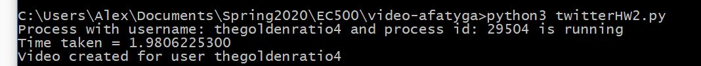
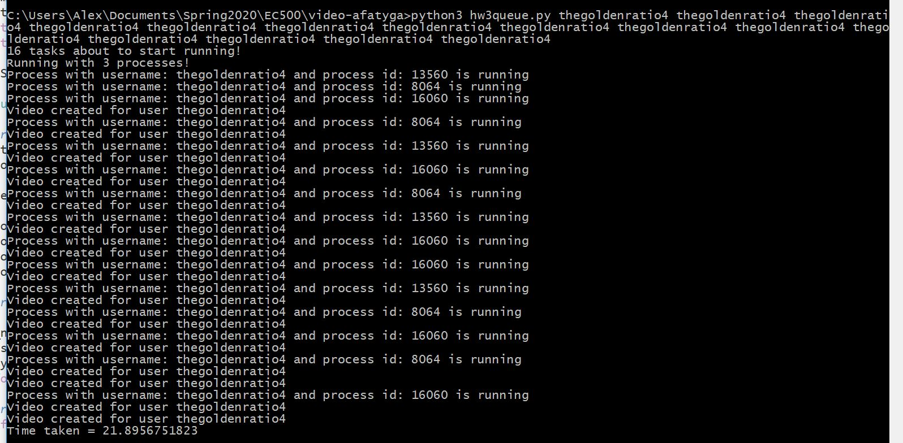
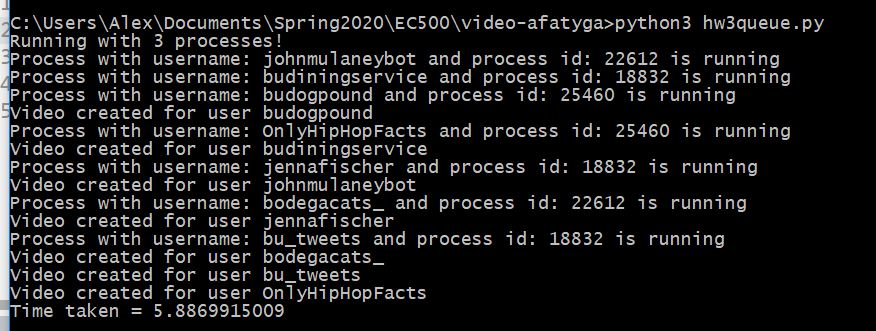
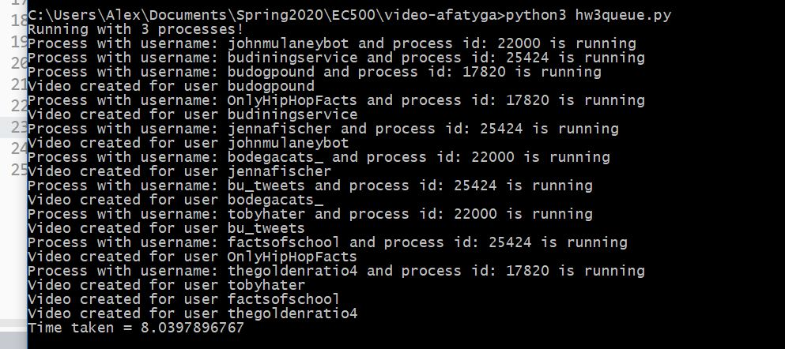
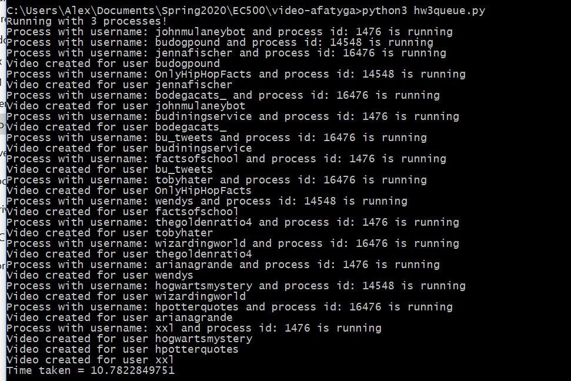

# video-afatyga
EC500 C1 Alex Fatyga  
Adapting the previous assignment, this homework uses multithreading and multiprocessing to create a video of the tweets and pictures of many specified users. I use multithreading when creating the images of the tweets and pictures and is used in the implementation of generating one video. I use multiprocessing to create many videos at time for different users. Each process uses multithreading and having many processes at a time is multiprocessing.  
File twitterHW2.py implements the multithreading and generates a video for one user. File HW3Queue.py multiprocesses twitterHW2.py to create many videos at a time.

# Installation
- Git clone this repo!
- Set up Twitter Developer account
- in terminal, run pip3 install -r requirements.txt

# To Use
- 2 ways: 
1. using restartProgram (batch or bash) and modify to run with the twitter users you want, example is provided in code but another is => python3 hw3queue.py user1 user2 user3 user4
2. in terminal, run python3 hw3queue.py user1 user2 user3        (and so on), this way will not delete other pictures or videos previously created

# Task 1 
Task 1 is located in ./task1/  
I tested the code provided in Python Threads vs Processes and saw that CPU bound was faster than IO bound!

# Main Exercise
Using the twitter feed, construct a daily video summarizing a twitter handle day  
- Convert text into an image in a frame
- Do a sequence of all texts and images in chronological order.
- Display each video frame for 3 seconds 
   
This is completed in twitterHW2.py (using HW2's twitter API assignment)  
getMsg(username) - takes in an input username and returns a list of tuples of text or a url and a 0 or 1 to signify whether the first of the tuple is a string of the tweet or a url of the image associated  
saveAsFile(textOrUrl, boolVal, count) - takes in a string, a 1 or 0 to indicate whether the first argument is tweet or a url and a count to know what to save the file as. Each image is saved as "tweets" count# ".png".   
imageThreads(listOfLinks, count) - creates threads to run saveAsFile, each thread is an image to be created, the function iterates through listOfLinks to create the thread and returns a list of threads. count is the starting number for the filenames and increments count while iterating through listOfLinks to always assign a different filename. This starting number is important so that with multiporcessing there aren't processes using the same files when creating the video.  
createVideo(num) - this function creates the video by using a subprocess. num specifies which process is running and is multiplied by 100 (as with the count in each filename). This value multiplied by 100 is the starting number for when creating the video from images. For example, a starting number of 100 means the video will be created from images saved as tweets100.png and upwards.  

# Rest of Assignment
Establish a processing criteria:  
- How many API calls you can handle simultaneously and why? 3 => using multi.processing.cpu_count() - 1 I found that my computer can handle 3 simultaneous API calls
- For example, run different API calls at the same time? Yes with different child process IDs using multiprocessing.Pool
- Split the processing of an API into multiple threads? This is done in the creation of images, creating one image is one thread so when I create 10 images, there will be 10 threads
- Include tracking interface to show how many processes are going on and success of => prints into the terminal
   
For multiprocessing, the usernames you want to run through should be specified in the bash or batch file restartProgram, this file deletes the videos and pictures as well and then run hw3Queue.py with the listed usernames.  
However, a user can just run python3 hw3queue.py username1 username2 username3 ...  by itself and specify the usernames after  
hw3queue.py calls runProcesses with the list of usernames, it gets the time at the beginning before any processes have been called and then creates a pool with the amount of processes allowed concurrently (found through cpu.count() - 1) and uses map_async on the function startUp (from twitterHW2.py) and the list of usernames (with their count associated so pictures and videos can create correctly). It then gets the time at the end and subtracts to give a final run time.

# The multiprocessing of HW3Queue.py Further Explained (and with examples!)
I use multiprocessing.Pool with the argument (cpu_count() - 1) as the amount of processes.  
I run map_async with a list of the usernames and their count (for example, [['user1',0], ['user2',1], ['user3',2]] )  
I then .close() and .join() on the pool after all processes have completed.  
I use map_async because I found it to be faster than map.  
The following example is using twitterHW2 with 1 username, this account creates many pictures and a long video and therefore, takes a longer time 
 
 
The following example is with the same account but completed 16 times (creating the same pictures and videos 16 times but not knowing that the pictures of videos are the same which therefore, does not affect speed) with 3 processes running at a time, it shows a much better improved time by using multiprocessing  
 
   
The following examples are with a variant amount of tasks using all different accounts (some taking less time, some taking much more):  
7 tasks:    
10 tasks :    
16 tasks :  

